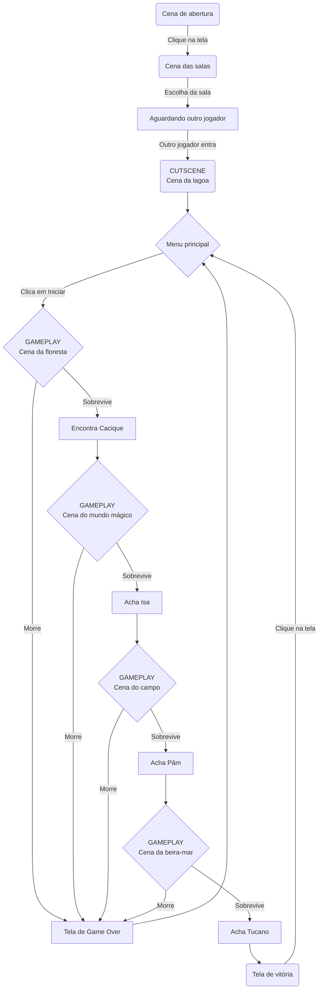

 

    

## Premissa do jogo:

&nbsp; &nbsp; 5 patinhos foram passear além das montanhas para brincar, a mamãe gritou quack quack quack quack, mas só 2 patinhos voltaram de lá, que agora irão trilhar uma aventura repleta de cenários e obstáculos em busca de seus irmãos perdidos pelo caminho. Durante sua aventura, junte migalhas para desbloquear novos acessórios estilosos e patos incríveis para se jogar. O jogo conta com um multiplayer online numa gameplay estilo arcade. És capaz de chegar ao final desta jornada? Quack quack!

## Referências do jogo:

- Crossy Road (jogo);
- Forager (jogo);
- Super Chicken Jumper (jogo);
- Cinco Patinhos (música infantil);
- O Patinho Feio (conto);

## Receita do Jogo:

- Anúncios pós-morte para continuar a tentativa (run) atual;
- Acessórios exclusivos (e algumas vezes limitados) liberados apenas por moedas obtidas através de microtransações;
- Versão premium do jogo sem anúncios;
- Season pass que desbloqueia todos os acessórios atuais e futuros (exceto os limitados).

## Objetivo do Jogo:

&nbsp; &nbsp; Com o objetivo de tranquilizar a Mamãe Pato, você sai em uma jornada em busca de seus irmãos patinhos, que foram brincar em diversos lugares diferentes, mas não atenderam o chamado de sua mãe. Seu objetivo é achá-los e trazê-los novamente ao ninho, pois já passou da hora de brincar.

## Jogo Ideal:

### Personagens:

#### Thiaguinho
&nbsp; &nbsp; O mais amarelo dos patinhos, Thiaguinho é um pato comum mas isso de jeito algum tira seu brilho. O pato do meio foi o único que atendeu ao chamado de sua mãe, pois estava perto o suficiente para ouvir. A fim de tranquilizar a Mamãe Pato, Thiaguinho sai em busca de seus irmãos apenas com coragem e pedras (várias delas).

#### Cacique
&nbsp; &nbsp; Brincando no meio de um matagal, Cacique foi encontrado por Thiaguinho e agora junta-se a ele na busca de seus irmãos. Sendo o caçula do grupo, Cacique tem menos noção do perigo e acaba se metendo em meio de diversos animais mortais na floresta onde brincava. Para lidar com o perigo, Cacique anda armado com sua zarabatana o tempo todo, disparando incessantes dardos em seus inimigos.

#### Isa
&nbsp; &nbsp; Isa, a patinha mais velha e curiosa, acaba viajando acidentalmente para um mundo mágico onde as regras do nosso cotidiano não se aplicam. A magia é volátil e apenas os mais sábios conseguem utilizá-la ao seu favor. Felizmente, dominar a arte da magia não foi um desafio para a pata branca, que aproveitou de seu alto intelecto para tirar proveito da magia.

#### Pâm
&nbsp; &nbsp; Pâm, um marreco-selvagem, é uma patinha que adora a brisa do campo. As vastas terras verdejantes têm espaço de sobra para Pâm praticar seu hobby favorito: futebol. Essa escandalosa patinha pode ser considerada um prodígio entre os patos quando o assunto é jogar bola. Artilheira nata, Pâm chuta bolas como ninguém, fazendo-as voar a velocidades exorbitantes, o suficiente para desmaiar alguém.

#### Tucano
&nbsp; &nbsp; Tucano, que tem nome de pássaro, vive com patos mas na verdade é um ganso, foi encontrado na beira do mar, fazendo sabe-se lá o que. Tucano é um mistério entre os patinhos e é de longe o patinho mais distante da familia, tanto em aparência quanto em distância. Ele não é dos mais inteligentes, mas consegue compensar isso com seu incrível vigor físico, não precisando de nada além de seu próprio bico para enfrentar as adversidades.

#### Mamãe Pato
&nbsp; &nbsp; A Mamãe Pato é a preocupada e carinhosa mãe dos patinhos. Mesmo sendo a progenitora de seres estranhamente únicos, a Mamãe Pato é surpreendente normal, tendo as mesmas preocupações de qualquer mãe de qualquer espécie. Nessa ocasião, ela teme pela segurança de seus filhos, que segundo ela, são jovens demais para saírem por aí brincando sozinhos longe do ninho.

### Universo:

&nbsp; &nbsp; O universo retratado no jogo é semelhante ao nosso próprio universo, com algumas ressalvas. Os animais selvagens e obstáculos ao longo do caminho no nosso mundo talvez não sejam tão "letais" quanto no universo do jogo, mas nesse contexto, a perda de vidas representa muito mais o patinho possivelmente se machucando do que realmente tendo um destino fatal. A maior ressalva no entanto, se trata da magia, que nesse universo está presente de maneira natural apenas em um "mundo mágico" alternativo. A magia funciona como o fogo, acontecendo de maneira natural no mundo (no caso da magia, no mundo mágico) em casos isolados, mas podendo ser "manipulado", assim como o ser humano hoje em dia consegue ter domínio sobre o fogo. Para se manipular a magia, o indivíduo tem que ser dotado de tremenda astúcia e inteligência, algo que um filhote de pato raramente conseguiria ter. Vale a pena ressaltar que os animais nesse jogo são um pouco mais inteligentes e sencientes do que em nosso mundo.

### Regras do jogo

- Runner vertical;
- Controle para os lados (esquerda e direita); 
- Quantidade de vidas limitada (perdidas ao bater em obstáculos e tomar dano de inimigos);
- Quando o pato colide no obstáculo, fica invulnerável por alguns instantes;
- Pato dispara projétil que é apenas efetivo em inimigos (porém pode colidir com obstáculos);
- Medidor de distância no topo da tela;
- Chegada uma certa distância, muda a fase, mudando os inimigos e obstáculos;
- Ao longo do caminho, o pato coleta "migalhas", que estão dispostas no chão e também são largadas pelos inimigos;
- Migalhas servem para desbloquear novos patos e acessórios.

### Desenvolvimento/enredo:

&nbsp; &nbsp; Era uma vez, 6 patos que viviam tranquilamente em seu ninho próximo à lagoa, a Mamãe Pato e seus 5 filhos: Isa, Tucano, Thiaguinho, Pâm e Cacique. Eles sempre foram uma família bem excêntrica, pois cada filho era bem único e diferente um do outro, algo que não era comum entre as famílias de pato por aí espalhadas. Apesar de suas diferenças, os Patinhos eram uma família bem unida e que não abalaria tão fácil, assim como tantas outras famílias animais das redondezas. Devido a esse forte laço entre os Patinhos, a Mamãe Pato começou a conceder cada vez mais liberdade aos seus filhotes, a medida que cada um deles ia crescendo. Um dia, a Mamãe Pato liberou sua prole para ir brincar além das montanhas (algo que era muito pedido pelos próprios patinhos), contanto que voltassem assim que ouvissem o seu gracitar.

&nbsp; &nbsp; O jogo começa quando Thiaguinho ouve o chamado de sua mãe, e logo descobrindo que foi o único a ter escutado e voltado ao ninho. Após ver a expressão de preocupação estampada no rosto de sua mãe, Thiaguinho decide ir atrás do resto de sua família por conta própria, enfrentando todos os obstáculos até achar o último patinho.

&nbsp; &nbsp; Assim que Thiaguinho ultrapassa as montanhas, ele se vê de frente com uma vasta floresta, onde ele decide entrar para ver se encontra algum de seus irmãos. Após passar por obstáculos (ex. troncos, arbustos espinhentos) e por inimigos (animais selvagens, ex. cobras), Thiaguinho encontra seu irmão mais novo: Cacique, que estava se aventurando pela floresta. Apesar de jovem, Cacique estava bem preparado para evitar e, se necessário, combater possíveis ameaças presentes na natureza, pois esse pato possui uma incrível familiaridade com esse ambiente (apesar de ter vivido a maior parte de sua vida na lagoa).

&nbsp; &nbsp; Ao fim da floresta, entre as árvores, Thiaguinho acha um caldeirão bem estranho e que, de uma forma exótica, parecia estar "chamando" o patinho para dentro. Ao decidir adentrar o caldeirão, Thiaguinho percebe que, na verdade, o caldeirão serviu como um portal e agora ele está em um mundo alternativo e cheio do que conhecemos como "magia". Depois de superar algumas anomalias mágicas, Thiaguinho encontra Isa, sua irmã mais velha. Isa sentiu como se a magia estivesse a "chamando" e entrou no mesmo caldeirão que teleportou seu irmão. Com o pouco tempo que Isa passou nesse mundo mágico, ela foi capaz de manipular a magia com maestria (principalmente considerando que ela é uma filhote de pato).

&nbsp; &nbsp; Depois de achar um portal de volta para o mundo normal, Thiaguinho se vê em um enorme campo aberto, onde há colinas que parecem não ter fim. Após passar algum tempo desviando de cercas e evitando os animais (ex. bodes) que habitam por lá, Thiaguinho acaba achando sua outra irmã: Pâm. Pâm sempre gostou de jogar futebol (algo incomum para um pato), porém, no lugar onde ela mora, praticar esse esporte fica difícil, já que a bola sempre acabava indo parar no meio da lagoa. Além de querer jogar bola em um campo aberto, Pâm sempre teve afinidade com outros animais que não fossem pato, o que também motivou a patinha a querer brincar nesse lugar e facilitou sua estadia entre os bichos dessas colinas.

&nbsp; &nbsp; Após passar pelo campo, Thiaguinho se encontra na beira-mar: um ponto onde muitos animais se unem para socializar. Depois de ultrapassar muitos animais mal-intencionados, Thiaguinho acha o patinho mais sociável e atlético entre os Patinhos: Tucano. Esse patinho adora multidões e de ser o centro das atenções, então se algum patinho estaria na beira-mar, seria ele. A beira-mar também é um bom local para se praticar esportes, algo de que Tucano gosta e tem bastante aptidão. Infelizmente, para compensar a grande proeza física desse pato (que na realidade é um ganso), sua noção sobre as coisas é extremamente limitada. A sua falta de noção talvez não fosse perigosa quando Tucano se encontrava no ninho, mas agora sozinho e na beira-mar, ele corria um alto risco de se meter com animais de caráter duvidoso.

&nbsp; &nbsp; Depois de encontrar todos os patinhos filhotes, a missão de Thiaguinho está completa. Após todos voltarem ao ninho, a Mãmãe Pato pode voltar a respirar tranquilamente e os Patinhos podem voltar a conviver nessa família muito amorosa e nada ortodoxa.

##Fluxograma das cenas

